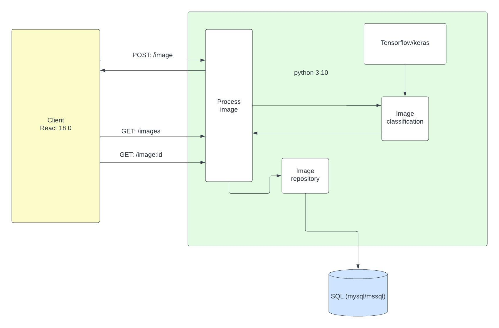

## Image recognition app

### Diagram:

https://lucid.app/lucidchart/06212b2e-3a73-4c88-b763-cd3ce1c861d9/edit?beaconFlowId=F456FCCE45AE769D&invitationId=inv_7ffbc0bb-a56f-41cf-8fdf-72ade88a3f57&page=0_0#

### TODO:

data comes in as image/png;base64

keras to work with base64 to work with 

training data - add to folder, train keras on this data

save images to db (mysql/mssql) 

